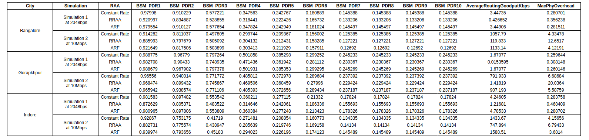

# Routing in VANET using ns-3
 Simulation of Robust Rate Adaption Algorithm on VANET on ns-3 simulator using [vanet-routing-compare.cc](https://gitlab.com/nsnam/ns-3-dev/-/blob/master/src/wave/examples/vanet-routing-compare.cc).

## Contents

- [Routing in VANET using ns-3](#routing-in-vanet-using-ns-3)
  - [Contents](#contents)
  - [Vehicular Ad hoc Network](#vehicular-ad-hoc-network-)
  - [Robust Rate Adaption Algorithm](#robust-rate-adaption-algorithm-)
  - [Building and Running](#building-and-running-)
  - [Simulation setup](#simulation-setup-)
  - [Results and Analysis](#results-and-analysis-)
  - [Observations](#observations-)
  - [Contact](#contact-)

## Vehicular Ad hoc Network [&uarr;](#contents)
VANETs  are  distributed,  self-organizing communication networks built up from traveling vehicles, and are thus characterized by very high speed andlimited degrees of freedom in nodes movement patterns. Such particular features often make standard networking protocolsinefficient or unusable in VANETs.[(src)](https://ieeexplore.ieee.org/abstract/document/4127230)

## Robust Rate Adaption Algorithm [&uarr;](#contents)

 Robust Rate Adaption Algorithm uses short-term loss ratio to opportunistically guide its rate change decisions, andan adaptive RTS filter to prevent collision losses from triggering rate decrease

 RRAA has two components:
 * **Short-term loss ratio(RRAA-basic):** to assess the channel and opportunistically adapt the runtime transmission rate. 
 * **Adaptive RTS filter:** to filter out collision losses with small overhead.

### RRAA-basic [&uarr;](#contents)
 All the parameters vary depending on the transmission rate. Three parameters:
 * Estimation window size(ewnd): Whenever a new rate is chosen, it is used to transmit the next ewnd frames. Around 5- 40 frames.
 * Maximum Tolerable Loss threshold (MTL): The maximum loss ratio tolerable after which the transmission rate is decreased. 
 * Opportunistic Rate Increase threshold (ORI): The loss ratio after which the transmission rate is increased. 

**Algorithm:**
```
R=highest_rate;
counter=ewnd(R);
while true do
  rcv_tx_status(last_frame);
  P = update_loss_ratio();
  if( counter == 0 )
    if (P > PMTL) then R = next_lower_rate();
    elseif (P < PORI) then R = next_high_rate();
    counter = ewnd(R);
  send(next_frame,R);
  counter--;
```

### Adaptive RTS filter [&uarr;](#contents)

The following parameteres are used in the Adaptive RTS filter component:
* RTSWnd = Number of data frames to be sent with RTS frames.
* RTScounter = Counter to keep track of number of data frames already sent with RTS.
* RTSOn =  True implies RTS is being sent while transmission.

**Algorithm:**
```
RTSWnd = 0;
RTScounter = 0;
while true do
  rcv_tx_status(last_frame)
  if(!RTSOn and !Success) then
     RTSWnd++;
     RTScounter = RTSWnd;
   elseif(RTSOn xor Success) then
     RTSWnd = RTSWnd/2;
     RTScounter = RTSWnd;
   if(RTScounter > 0) then
     TurnOnRTS(next_frame);
     RTScounter--;
```

### RRAA Algorithm [&uarr;](#contents)
```
while true do
 rcv_tx_status(last_frame);
 A-RTS();
 if(!RTSFail) then
    RRAA_BASIC();
    if(RTSWnd > 3) then
       fix_re_tx_rate();

```

## Building and Running [&uarr;](#contents)

The simulation is run on ns-3 simulator program. The map data is created using OpenStreetMap. More detail on building and running the simulation can be found [here](./RUN.md).

## Simulation setup [&uarr;](#contents)

The simulation is run on the map of three cities Bangalore, Gorakhpur and Indore. The OSM data as well as te mobility file can be found inside `<city-name>/map-data`. The output obtained are stored in `<city-name>/<simulation-name>/<RAA-output>`.

The simulation is run for 300seconds with 32 vehicles on three different rate adpatation alogirthms already implemented in ns-3;
Constant Rate, RRAA and ARF. Two different data rate are chosen for the simulation `2048Kbps` and `10Mbps`.

The following parameter are used/modified based on the need to run the simulations.

`m_traceFile`: The ns2 mobility file to run the simulation.

`m_nNodes`: Number of nodes/vehicles used to run the simulation.

`m_rate`: Data rate of the transmission.

The below table summarizes the different valued of parameters.

| Paramtere                       | Simulation 1        | Simulation 2        | Simulation 3        |  Simulation 4       | Simulation 5 |
|---------------------------------|---------------------|---------------------|---------------------|---------------------|--------------|
| Average speed of the nodes      | 20m/s               | 20m/s               | 20m/s               | 20m/s               | 20m/s        |
| Environment                     | Urban               | Urban               | Urban               | Urban               | Urban        |
| No of vehicles                  | 32                  | 32                  | **20**              | **64**              | **128**      |
| Connectivity Range of the nodes | 50m-500m            | 50m-500m            | 50m-500m            | 50m-500m            | 50m-500m     |
| Routing protocol                | AODV                | AODV                | AODV                | AODV                | AODV         |
| Packet size                     | 200 Bytes           | 200 Bytes           | 200 Bytes           | 200 Bytes           | 200 Bytes    |
| Time of simulation              | 300sec              | 300sec              | 300sec              | 300sec              | 300sec       |
| Data source rate                | 2048bps             | **10Mbps**          | 2048bps             | 2048bps             | 2048bps      |
| MAC                             | IEEE 802.11p        | IEEE 802.11p        | IEEE 802.11p        | IEEE 802.11p        | IEEE 802.11p |       

## Results and Analysis [&uarr;](#contents)

The OSM map and associated files are present in the directory `<city-name>/map-data`. Below is an example of the map of Indore taken for simulations.


The below table summarized the results obtained for various simulations:


The Netanim simulation file if also generated for each of the simultion. Below is an example of the Netanim simulation for [Moving- Simulation-1-2048bps for the RRAA algorithm](./indore/Moving-Simulation-1-2048bps/RRAA-output/indore-RRAA.xml).


The below table summarized the result obatined for different cities at different data rates:



The Attributes obtained from the results are as follows:
- `BSM_PDR1`: The packet drop ratio for a safety packet at 50 m.
- `BSM_PDR2`: The packet drop ratio for a safety packet at 100 m.
- `BSM_PDR3`: The packet drop ratio for a safety packet at 150 m.
- `BSM_PDR4`: The packet drop ratio for a safety packet at 200 m.
- `BSM_PDR5`: The packet drop ratio for a safety packet at 250 m.
- `BSM_PDR6`: The packet drop ratio for a safety packet at 300 m.
- `BSM_PDR7`: The packet drop ratio for a safety packet at 350 m.
- `BSM_PDR8`: The packet drop ratio for a safety packet at 400 m.
- `BSM_PDR9`: The packet drop ratio for a safety packet at 450 m.
- `BSM_PDR10`: The packet drop ratio for a safety packet at 500 m.
- `AverageRoutingGoodputKbps`: The average Goodput obtained in Kbps.
- `MacPhyOverhead`: MAC/PHY overhead is the extra bits added in the packet along with the actual message at MAC layer and Physical layer. 

The plot of Average routing goodput for each of the city for the algorithms ARF, constant rate and RRAA at 2048bps is below:


The plot of Average routing goodput for each of the city for the algorithms ARF, constant rate and RRAA at 10Mbps is below:


## Observations [&uarr;](#contents)

## Contact [&uarr;](#contents)

This project and repository is created and maintained by:

* **Manas Gupta**

 Email: manasgupta1109@gmail.com
    
 Github: [manas11](https://github.com/manas11)
    
* **Animesh Kumar**

 Email: animuz111@gmail.com
    
 Github: [animeshk08](https://github.com/animeshk08)

 * **Ayush Kumar**

 Email: a.ayushkumar1997@gmail.com
    
 Github: [ayush4190](https://github.com/ayush4190)
