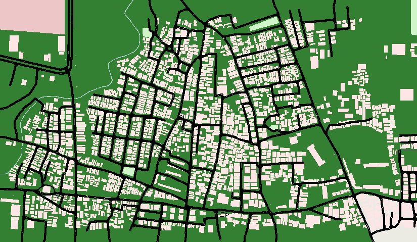
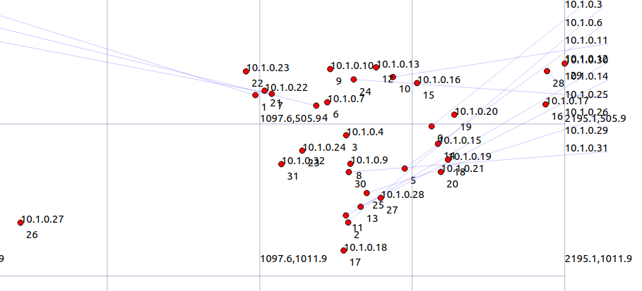
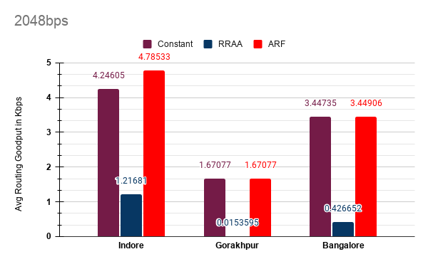
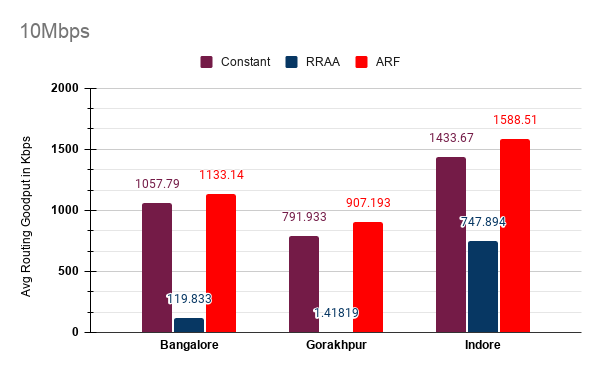
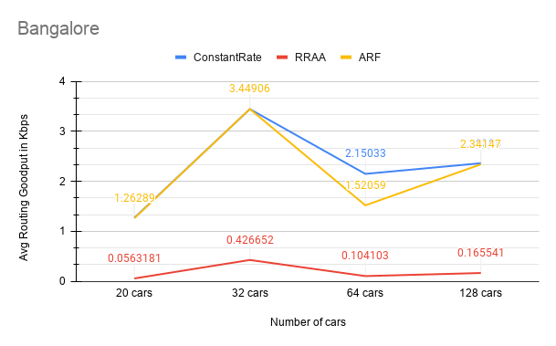
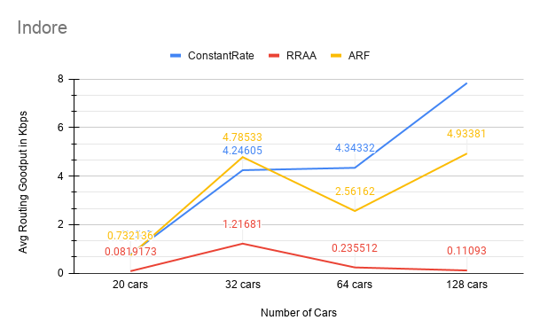
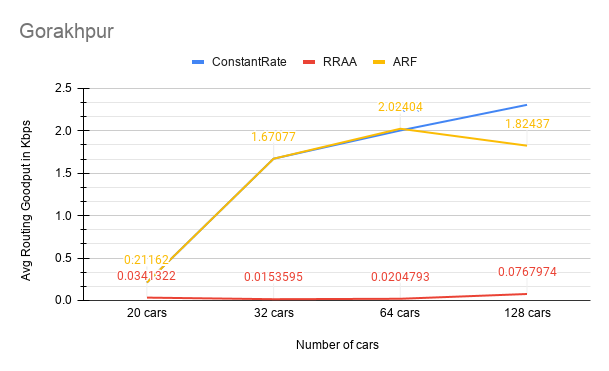
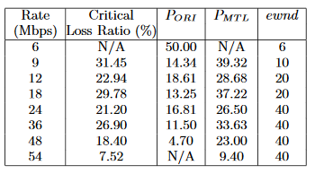

# Routing in VANET using ns-3
 Simulation of Robust Rate Adaption Algorithm on VANET on ns-3 simulator using [vanet-routing-compare.cc](https://gitlab.com/nsnam/ns-3-dev/-/blob/master/src/wave/examples/vanet-routing-compare.cc).

## Contents

- [Routing in VANET using ns-3](#routing-in-vanet-using-ns-3)
  - [Contents](#contents)
  - [Vehicular Ad hoc Network](#vehicular-ad-hoc-network-)
  - [Robust Rate Adaption Algorithm](#robust-rate-adaption-algorithm-)
  - [Building and Running](#building-and-running-)
  - [Simulation setup](#simulation-setup-)
  - [Results and Analysis](#results-and-analysis-)
  - [Observations](#observations-)
  - [Contact](#contact-)

## Vehicular Ad hoc Network [&uarr;](#contents)
VANETs  are  distributed,  self-organizing communication networks built up from traveling vehicles, and are thus characterized by very high speed andlimited degrees of freedom in nodes movement patterns. Such particular features often make standard networking protocolsinefficient or unusable in VANETs.[(src)](https://ieeexplore.ieee.org/abstract/document/4127230)

## Robust Rate Adaption Algorithm [&uarr;](#contents)

 Robust Rate Adaption Algorithm uses short-term loss ratio to opportunistically guide its rate change decisions, andan adaptive RTS filter to prevent collision losses from triggering rate decrease

 RRAA has two components:
 * **Short-term loss ratio(RRAA-basic):** to assess the channel and opportunistically adapt the runtime transmission rate. 
 * **Adaptive RTS filter:** to filter out collision losses with small overhead.

### RRAA-basic [&uarr;](#contents)
 All the parameters vary depending on the transmission rate. Three parameters:
 * Estimation window size(ewnd): Whenever a new rate is chosen, it is used to transmit the next ewnd frames. Around 5- 40 frames.
 * Maximum Tolerable Loss threshold (MTL): The maximum loss ratio tolerable after which the transmission rate is decreased. 
 * Opportunistic Rate Increase threshold (ORI): The loss ratio after which the transmission rate is increased. 

**Algorithm:**
```
R=highest_rate;
counter=ewnd(R);
while true do
  rcv_tx_status(last_frame);
  P = update_loss_ratio();
  if( counter == 0 )
    if (P > PMTL) then R = next_lower_rate();
    elseif (P < PORI) then R = next_high_rate();
    counter = ewnd(R);
  send(next_frame,R);
  counter--;
```

### Adaptive RTS filter [&uarr;](#contents)

The following parameteres are used in the Adaptive RTS filter component:
* RTSWnd = Number of data frames to be sent with RTS frames.
* RTScounter = Counter to keep track of number of data frames already sent with RTS.
* RTSOn =  True implies RTS is being sent while transmission.

**Algorithm:**
```
RTSWnd = 0;
RTScounter = 0;
while true do
  rcv_tx_status(last_frame)
  if(!RTSOn and !Success) then
     RTSWnd++;
     RTScounter = RTSWnd;
   elseif(RTSOn xor Success) then
     RTSWnd = RTSWnd/2;
     RTScounter = RTSWnd;
   if(RTScounter > 0) then
     TurnOnRTS(next_frame);
     RTScounter--;
```

### RRAA Algorithm [&uarr;](#contents)
```
while true do
 rcv_tx_status(last_frame);
 A-RTS();
 if(!RTSFail) then
    RRAA_BASIC();
    if(RTSWnd > 3) then
       fix_re_tx_rate();

```

## Building and Running [&uarr;](#contents)

The simulation is run on ns-3 simulator program. The map data is created using OpenStreetMap. More detail on building and running the simulation can be found [here](./RUN.md).

## Simulation setup [&uarr;](#contents)

The simulation is run on the map of three cities Bangalore, Gorakhpur and Indore. The OSM data as well as te mobility file can be found inside `<city-name>/map-data`. The output obtained are stored in `<city-name>/<simulation-name>/<RAA-output>`.

The simulation is run for 300seconds with 32 vehicles on three different rate adpatation alogirthms already implemented in ns-3;
Constant Rate, RRAA and ARF. Two different data rate are chosen for the simulation `2048Kbps` and `10Mbps`.

The following parameter are used/modified based on the need to run the simulations.

`m_traceFile`: The ns2 mobility file to run the simulation.

`m_nNodes`: Number of nodes/vehicles used to run the simulation.

`m_rate`: Data rate of the transmission.

The below table summarizes the different valued of parameters.

| Paramtere                       | Simulation 1        | Simulation 2        | Simulation 3        |  Simulation 4       | Simulation 5 |
|---------------------------------|---------------------|---------------------|---------------------|---------------------|--------------|
| Average speed of the nodes      | 20m/s               | 20m/s               | 20m/s               | 20m/s               | 20m/s        |
| Environment                     | Urban               | Urban               | Urban               | Urban               | Urban        |
| No of vehicles                  | 32                  | 32                  | **20**              | **64**              | **128**      |
| Connectivity Range of the nodes | 50m-500m            | 50m-500m            | 50m-500m            | 50m-500m            | 50m-500m     |
| Routing protocol                | AODV                | AODV                | AODV                | AODV                | AODV         |
| Packet size                     | 200 Bytes           | 200 Bytes           | 200 Bytes           | 200 Bytes           | 200 Bytes    |
| Time of simulation              | 300sec              | 300sec              | 300sec              | 300sec              | 300sec       |
| Data source rate                | 2048bps             | **10Mbps**          | 2048bps             | 2048bps             | 2048bps      |
| MAC                             | IEEE 802.11p        | IEEE 802.11p        | IEEE 802.11p        | IEEE 802.11p        | IEEE 802.11p |       

## Results and Analysis [&uarr;](#contents)

The OSM map and associated files are present in the directory `<city-name>/map-data`. Below is an example of the map of Indore taken for simulations.



The below table summarized the results obtained for various simulations:


The Netanim simulation file if also generated for each of the simultion. Below is an example of the Netanim simulation for [Moving- Simulation-1-2048bps for the RRAA algorithm](./indore/Moving-Simulation-1-2048bps/RRAA-output/indore-RRAA.xml).



The below table summarized the result obatined for different cities at different data rates:

**Bangalore**
| CARS     | ALGORITHM    | AverageRoutingGoodputKbps | MacPhyOverhead | BSM_PDR1 | BSM_PDR2 | BSM_PDR3 | BSM_PDR4 | BSM_PDR5 | BSM_PDR6 | BSM_PDR7  | BSM_PDR8  | BSM_PDR9  | BSM_PDR10 |
|----------|--------------|---------------------------|----------------|----------|----------|----------|----------|----------|----------|-----------|-----------|-----------|-----------|
| 20cars   | ConstantRate | 1.26972                   | 0.230429       | 0.982327 | 0.939187 | 0.613537 | 0.401691 | 0.291095 | 0.222817 | 0.178121  | 0.178121  | 0.178121  | 0.178121  |
|          | ARF          | 1.26289                   | 0.230599       | 0.982489 | 0.939491 | 0.613537 | 0.401691 | 0.291095 | 0.222817 | 0.178121  | 0.178121  | 0.178121  | 0.178121  |
|          | RRAA         | 0.0563181                 | 0.266647       | 0.971625 | 0.916581 | 0.595209 | 0.389692 | 0.2824   | 0.216161 | 0.1728    | 0.1728    | 0.1728    | 0.1728    |
| 32cars   | ConstantRate | 3.44735                   | 0.280701       | 0.97998  | 0.910229 | 0.577221 | 0.347563 | 0.242767 | 0.180889 | 0.145388  | 0.145388  | 0.145388  | 0.145388  |
|          | ARF          | 3.44906                   | 0.281511       | 0.979554 | 0.910127 | 0.577654 | 0.347824 | 0.242949 | 0.181024 | 0.145497  | 0.145497  | 0.145497  | 0.145497  |
|          | RRAA         | 0.426652                  | 0.356238       | 0.920997 | 0.834687 | 0.528855 | 0.318441 | 0.222426 | 0.165732 | 0.133206  | 0.133206  | 0.133206  | 0.133206  |
| 64 cars  | ConstantRate | 2.15033                   | 0.288858       | 0.949028 | 0.804832 | 0.507745 | 0.339487 | 0.236003 | 0.173067 | 0.135549  | 0.135549  | 0.135549  | 0.135549  |
|          | ARF          | 1.52059                   | 0.28621        | 0.949452 | 0.804525 | 0.507372 | 0.339237 | 0.23583  | 0.17294  | 0.13545   | 0.13545   | 0.13545   | 0.13545   |
|          | RRAA         | 0.104103                  | 0.350447       | 0.914255 | 0.765189 | 0.483661 | 0.323384 | 0.224809 | 0.164858 | 0.12912   | 0.12912   | 0.12912   | 0.12912   |
| 128 cars | ConstantRate | 2.36365                   | 0.32533        | 0.856494 | 0.576845 | 0.350222 | 0.228262 | 0.162412 | 0.120737 | 0.0937863 | 0.0937863 | 0.0937863 | 0.0937863 |
|          | ARF          | 2.34147                   | 0.320655       | 0.855536 | 0.57488  | 0.348813 | 0.227344 | 0.161759 | 0.120251 | 0.0934092 | 0.0934092 | 0.0934092 | 0.0934092 |
|          | RRAA         | 0.165541                  | 0.403608       | 0.820568 | 0.555269 | 0.337827 | 0.220184 | 0.156664 | 0.116463 | 0.090467  | 0.090467  | 0.090467  | 0.090467  |


**Indore**
| CARS     | ALGORITHM    | AverageRoutingGoodputKbps | MacPhyOverhead | BSM_PDR1 | BSM_PDR2 | BSM_PDR3 | BSM_PDR4 | BSM_PDR5 | BSM_PDR6 | BSM_PDR7 | BSM_PDR8 | BSM_PDR9 | BSM_PDR10 |
|----------|--------------|---------------------------|----------------|----------|----------|----------|----------|----------|----------|----------|----------|----------|-----------|
| 20cars   | ConstantRate | 0.21162                   | 0.226676       | 0.985656 | 0.970419 | 0.625365 | 0.35744  | 0.271455 | 0.217268 | 0.163387 | 0.163387 | 0.163387 | 0.163387  |
|          | ARF          | 0.21162                   | 0.226665       | 0.986394 | 0.970655 | 0.625388 | 0.357453 | 0.271465 | 0.217276 | 0.163393 | 0.163393 | 0.163393 | 0.163393  |
|          | RRAA         | 0.0341322                 | 0.236834       | 0.972155 | 0.949868 | 0.609264 | 0.348237 | 0.264466 | 0.211674 | 0.15918  | 0.15918  | 0.15918  | 0.15918   |
| 32cars   | ConstantRate | 1.67077                   | 0.259644       | 0.988775 | 0.96779  | 0.797264 | 0.501858 | 0.385298 | 0.299252 | 0.245233 | 0.245233 | 0.245233 | 0.245233  |
|          | ARF          | 1.67077                   | 0.260146       | 0.988679 | 0.967902 | 0.797378 | 0.501931 | 0.385353 | 0.299295 | 0.245269 | 0.245269 | 0.245269 | 0.245269  |
|          | RRAA         | 0.0153595                 | 0.308148       | 0.982708 | 0.90433  | 0.748935 | 0.471436 | 0.361942 | 0.281112 | 0.230367 | 0.230367 | 0.230367 | 0.230367  |
| 64 cars  | ConstantRate | 2.00356                   | 0.267329       | 0.955739 | 0.920031 | 0.781249 | 0.6091   | 0.499166 | 0.399868 | 0.307434 | 0.307434 | 0.307434 | 0.307434  |
|          | ARF          | 2.02404                   | 0.274772       | 0.955245 | 0.919995 | 0.781393 | 0.609212 | 0.499258 | 0.399942 | 0.307491 | 0.307491 | 0.307491 | 0.307491  |
|          | RRAA         | 0.0204793                 | 0.34449        | 0.91868  | 0.876322 | 0.745182 | 0.58098  | 0.476122 | 0.381408 | 0.293241 | 0.293241 | 0.293241 | 0.293241  |
| 128 cars | ConstantRate | 2.30563                   | 0.288394       | 0.815197 | 0.631973 | 0.462628 | 0.340015 | 0.276011 | 0.224455 | 0.179971 | 0.179971 | 0.179971 | 0.179971  |
|          | ARF          | 1.82437                   | 0.281061       | 0.815716 | 0.632592 | 0.463078 | 0.340346 | 0.27628  | 0.224673 | 0.180146 | 0.180146 | 0.180146 | 0.180146  |
|          | RRAA         | 0.0767974                 | 0.332417       | 0.764165 | 0.603483 | 0.443685 | 0.326093 | 0.264709 | 0.215264 | 0.172602 | 0.172602 | 0.172602 | 0.172602  |


**Gorakhpur**
| CARS     | ALGORITHM    | AverageRoutingGoodputKbps | MacPhyOverhead | BSM_PDR1 | BSM_PDR2 | BSM_PDR3 | BSM_PDR4 | BSM_PDR5 | BSM_PDR6 | BSM_PDR7  | BSM_PDR8  | BSM_PDR9  | BSM_PDR10 |
|----------|--------------|---------------------------|----------------|----------|----------|----------|----------|----------|----------|-----------|-----------|-----------|-----------|
| 20cars   | ConstantRate | 0.776507                  | 0.236107       | 0.987487 | 0.946317 | 0.578167 | 0.357306 | 0.25547  | 0.189851 | 0.154588  | 0.154588  | 0.154588  | 0.154588  |
|          | ARF          | 0.732136                  | 0.259728       | 0.987946 | 0.946096 | 0.577638 | 0.356979 | 0.255236 | 0.189677 | 0.154446  | 0.154446  | 0.154446  | 0.154446  |
|          | RRAA         | 0.0819173                 | 0.299841       | 0.967972 | 0.910815 | 0.552296 | 0.341317 | 0.244038 | 0.181356 | 0.14767   | 0.14767   | 0.14767   | 0.14767   |
| 32cars   | ConstantRate | 4.24605                   | 0.283758       | 0.981583 | 0.897482 | 0.553542 | 0.360211 | 0.277115 | 0.21332  | 0.17824   | 0.17824   | 0.17824   | 0.17824   |
|          | ARF          | 4.78533                   | 0.288702       | 0.980965 | 0.897806 | 0.553809 | 0.360384 | 0.277248 | 0.213423 | 0.178326  | 0.178326  | 0.178326  | 0.178326  |
|          | RRAA         | 1.21681                   | 0.468409       | 0.872629 | 0.805371 | 0.483522 | 0.314646 | 0.242061 | 0.186336 | 0.155693  | 0.155693  | 0.155693  | 0.155693  |
| 64 cars  | ConstantRate | 4.34332                   | 0.298902       | 0.951714 | 0.815588 | 0.557316 | 0.384294 | 0.280415 | 0.219579 | 0.18124   | 0.18124   | 0.18124   | 0.18124   |
|          | ARF          | 2.56162                   | 0.302416       | 0.952144 | 0.816474 | 0.557897 | 0.384695 | 0.280708 | 0.219809 | 0.181429  | 0.181429  | 0.181429  | 0.181429  |
|          | RRAA         | 0.235512                  | 0.398725       | 0.89039  | 0.751681 | 0.511573 | 0.352753 | 0.257399 | 0.201557 | 0.166364  | 0.166364  | 0.166364  | 0.166364  |
| 128 cars | ConstantRate | 7.84017                   | 0.374959       | 0.818643 | 0.549515 | 0.339301 | 0.228324 | 0.164555 | 0.128207 | 0.104847  | 0.104847  | 0.104847  | 0.104847  |
|          | ARF          | 4.93381                   | 0.339719       | 0.820799 | 0.550227 | 0.339503 | 0.22846  | 0.164653 | 0.128284 | 0.10491   | 0.10491   | 0.10491   | 0.10491   |
|          | RRAA         | 0.11093                   | 0.477655       | 0.767149 | 0.51935  | 0.321164 | 0.216119 | 0.155759 | 0.121354 | 0.0992426 | 0.0992426 | 0.0992426 | 0.0992426 |

The Attributes obtained from the results are as follows:
- `BSM_PDR1`: The packet drop ratio for a safety packet at 50 m.
- `BSM_PDR2`: The packet drop ratio for a safety packet at 100 m.
- `BSM_PDR3`: The packet drop ratio for a safety packet at 150 m.
- `BSM_PDR4`: The packet drop ratio for a safety packet at 200 m.
- `BSM_PDR5`: The packet drop ratio for a safety packet at 250 m.
- `BSM_PDR6`: The packet drop ratio for a safety packet at 300 m.
- `BSM_PDR7`: The packet drop ratio for a safety packet at 350 m.
- `BSM_PDR8`: The packet drop ratio for a safety packet at 400 m.
- `BSM_PDR9`: The packet drop ratio for a safety packet at 450 m.
- `BSM_PDR10`: The packet drop ratio for a safety packet at 500 m.
- `AverageRoutingGoodputKbps`: The average Goodput obtained in Kbps.
- `MacPhyOverhead`: MAC/PHY overhead is the extra bits added in the packet along with the actual message at MAC layer and Physical layer. 

The plot of Average routing goodput for each of the city for the algorithms ARF, constant rate and RRAA at 2048bps is below:



The plot of Average routing goodput for each of the city for the algorithms ARF, constant rate and RRAA at 10Mbps is below:



The plot of Average routing goodput for Bangalore for the algorithms ARF, constant rate and RRAA with different number of cars:



The plot of Average routing goodput for Indore for the algorithms ARF, constant rate and RRAA with different number of cars:



The plot of Average routing goodput for Gorakhpur for the algorithms ARF, constant rate and RRAA with different number of cars:



## Observations [&uarr;](#contents)

Based on our simualations and above mentioned results, we found that the behaviour VANETs were higly dependent on the topology which in turn were dependent on the map of the region deployed as well the number of nodes.

**Observations on average throughput in different cities**
* The simulations were done on the map of three cities: Bangalore, Gorakhpur and Indore. The general observation in all the three cases were that, Constant rate had throughput close to that of ARF. However, RRAA was highly outperformed by both ARF and Constant Rate. This behaviour can be explained due to the low estimation windows in case of RRAA for smaller datarates as shown below. Thus  RRAA uses a smaller number of packets' loss stattics the calculation of the Packet Loss Ratio as compared to ARF which uses on 10 successfull ACK for moving to higher datarates. Thus due to the highly changing topology of the VANET's smaller estimation windows may lead to only instantaneous measurements rather the average behaviour of the network.



* RRAA’s approach is to minimize the delay due to the estimation window by using a short-term loss ratio and making the estimation window’s size adaptive. The problem with a adaptiuve estimation window size, especially during contention from multiple active clients, is that the client needs to get enough frame transmission statistics in this time, or else a statistically small number of samples may yield inaccurate rate adaptation.

* The reson for low throughput for both ARF and RRAA in case of VANETs can be justified as these rate adaptation algorithms use the number of successful transmission and loss statistics acquired by means of ACK or RTS/CTS (Request to Send/ Clear to Send) messages, which cannot be applied to broadcasting. This becomes promiment in the case of VANETs which have a highly changing topology sructure as well as the number of nodes. 

**Observations on change in vehicle number**
* Our simulation based for varying vehicle numbers were also insightful. We found that general behaviour in the three cities was that Constant rate had an increase in throughput with increase in vehicle number from 20 to 128 as the number of transmission had increased. Eventhough there was high congestion at higher number of vehicles since constant rate in not sensitive to collision or channel conditions the transmission continued at the set data rate.

  NOTE: Bangalore had a different behaviour for constant rate. 

* ARF is sentitive to only the channel condition and not collision hence when the network got congested at 64 nodes there was a sharp decrease in the throughput. On the other hand RRAA uses an adaptive RTS-filter to differentiate between collision and deterioration in channel conditions. Thus the decrease in the throughput in the case of RRAA was not as sharp as ARF which can be seen from the above mentioned line graphs.

* Both ARF and RRAA had an increase in throughput for 128 cars for the maps of Indore and Bangalore. This may be beacuse the number of transmission connections had outweighed the number of collision. Thus the VANET network was behaving as a tightly coupled wireless network.


## Contact [&uarr;](#contents)

This project and repository is created and maintained by:

* **Manas Gupta**

 Email: manasgupta1109@gmail.com
    
 Github: [manas11](https://github.com/manas11)
    
* **Animesh Kumar**

 Email: animuz111@gmail.com
    
 Github: [animeshk08](https://github.com/animeshk08)

 * **Ayush Kumar**

 Email: a.ayushkumar1997@gmail.com
    
 Github: [ayush4190](https://github.com/ayush4190)
